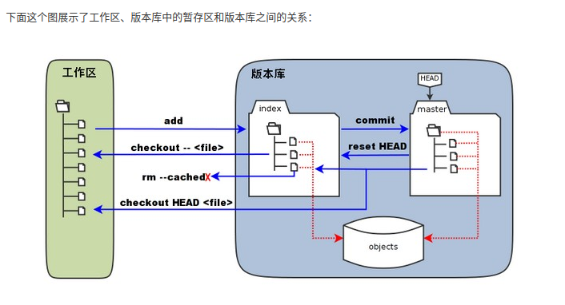
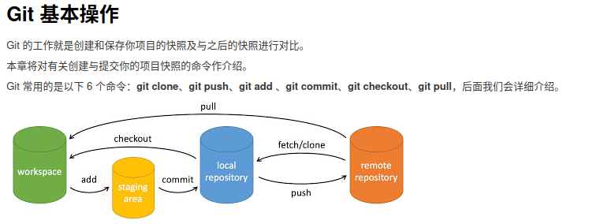
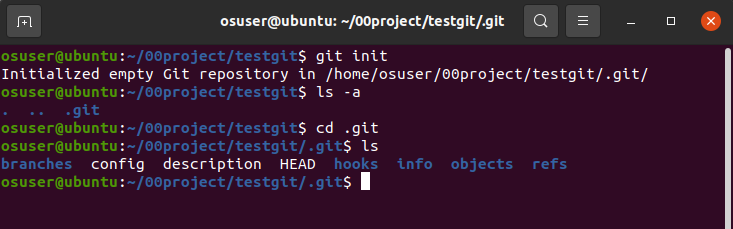

# git的使用

## 1.git的安装

使用库安装：

sudo apt update

sudo apt-get install git

测试：git --version

## 2.git工作流程

概念：

- **工作区：**就是你在电脑里能看到的目录。

- **暂存区：**英文叫 stage 或 index。一般存放在  .git 目录下的 index 文件（.git/index）中，所以我们把暂存区有时也叫作索引（index）。

- **版本库：**工作区有一个隐藏目录 .git，这个不算工作区，而是 Git 的版本库。

  

- 

## 3.git常用命令：

1）git项目创建

新建一个目录，在此目录下执行：git init 

执行后，会创建一个隐藏的.get目录：

2)add

